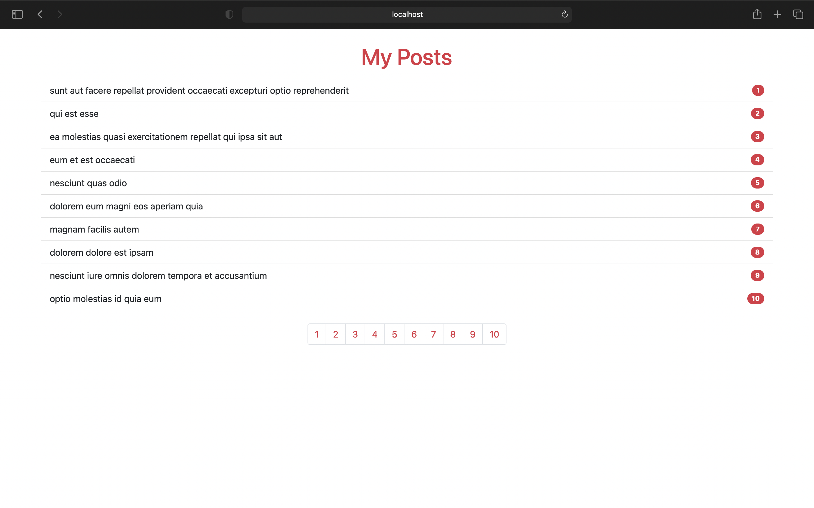

# Simple React Pagination

  

## ✨ Technologies

This project was developed with the following technologies:

- [CRA](https://create-react-app.dev)
- [JavaScript](https://developer.mozilla.org/en-US/docs/Web/JavaScript)

## 💻 Project

Frontend pagination example using React with Hooks
 

## ⚙️ Usage

- Clone the repository

In the project directory, you can run:

### `npm install`

### `npm start`

